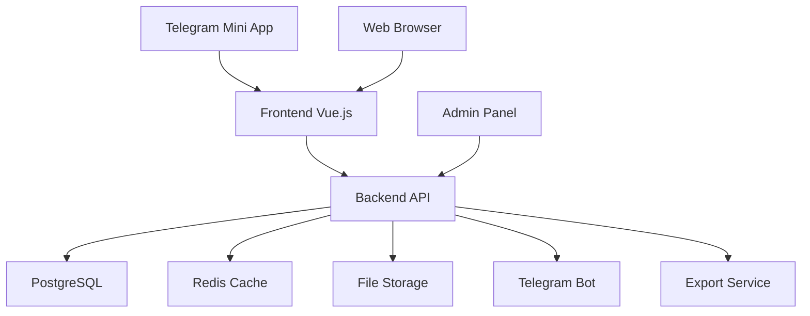

# Система «Умная премия»

> Внутренняя информационная система для еженедельного взаимного голосования сотрудников с автоматическим расчётом премий

[](https://opensource.org/licenses/MIT)
[](https://www.postgresql.org/)
[](https://vuejs.org/)
[](https://www.python.org/)
[](https://core.telegram.org/bots/webapps)

## 📋 Описание проекта

**«Умная премия»** — система для еженедельного взаимного голосования сотрудников, где каждый оценивает коллег по шкале 0-10. Система автоматически агрегирует оценки, формирует рейтинг и рассчитывает размер премий для каждого участника.

### Ключевые особенности

- 🗳️ **Еженедельное голосование** через Telegram Mini App и веб-интерфейс
- 📊 **Автоматический расчёт премий** с использованием сложных алгоритмов нормализации
- 👥 **Управление участниками** с гибкой системой ролей и статусов
- 📈 **Детальная аналитика** и экспорт результатов для бухгалтерии
- 🔐 **Безопасность** с авторизацией через Telegram WebApp и разграничением доступа
- 📱 **Адаптивный интерфейс** для мобильных и десктопных устройств

## 🚀 Быстрый старт

### Предварительные требования

- Docker и Docker Compose
- PostgreSQL 17+
- Python 3.11+
- Node.js 18+ (для фронтенда)
- Telegram Bot Token

### Установка

1. **Клонирование репозитория**
   ```bash
   git clone https://github.com/teristit/voting.git
   cd voting
   git checkout feature/smart-award-implementation
   ```

2. **Настройка окружения**
   ```bash
   cp .env.example .env
   # Отредактируйте .env файл с вашими настройками
   ```

3. **Запуск с Docker Compose**
   ```bash
   docker-compose up -d
   ```

4. **Инициализация базы данных**
   ```bash
   docker-compose exec backend python manage.py migrate
   docker-compose exec backend python manage.py create_admin
   ```

## 🏗️ Архитектура



### Компоненты системы

| Компонент | Технология | Назначение |
|-----------|------------|------------|
| **Frontend** | Vue 3, TailwindCSS | Интерфейс голосования и админ-панель |
| **Backend** | Python 3.11, FastAPI | API, бизнес-логика, расчёты |
| **База данных** | PostgreSQL 17 | Хранение данных, транзакции |
| **Кэш** | Redis | Сессии, временные данные |
| **Telegram** | WebApp SDK | Авторизация и мобильный интерфейс |
| **Инфраструктура** | Docker, Nginx | Контейнеризация и проксирование |

## 📚 Документация

### Основная документация

- [📖 Описание системы](docs/00_project_description.md) - Общий обзор и цели проекта
- [🏛️ Архитектура](docs/01_system_architecture.md) - Техническая архитектура и компоненты
- [⚙️ Функциональные требования](docs/02_functional_requirements.md) - Требования к функционалу
- [🔌 API и интеграции](docs/03_API_and_integration.md) - Документация REST API
- [🎨 Интерфейсы и UX](docs/04_interface_and_UX.md) - Описание пользовательских интерфейсов
- [🗄️ База данных](docs/05_database.md) - Схема БД и SQL-запросы
- [👨‍💼 Администрирование](docs/06_administration.md) - Руководство администратора

### Техническая документация

- [🔧 API Reference](docs/api/README.md) - Полная документация API
- [📊 Database Schema](docs/database/schema.md) - Подробная схема базы данных
- [🚀 Deployment Guide](docs/deployment/README.md) - Руководство по развёртыванию
- [🧪 Testing Guide](docs/testing/README.md) - Тестирование системы

## 🛠️ Разработка

### Структура проекта

```
voting/
├── backend/                 # Python Backend (FastAPI)
│   ├── app/
│   │   ├── api/            # REST API endpoints
│   │   ├── core/           # Конфигурация и утилиты
│   │   ├── models/         # SQLAlchemy модели
│   │   ├── services/       # Бизнес-логика
│   │   └── calculations/   # Алгоритмы расчёта премий
│   ├── migrations/         # Alembic миграции
│   └── tests/              # Тесты backend
├── frontend/               # Vue.js Frontend
│   ├── src/
│   │   ├── components/     # Vue компоненты
│   │   ├── views/          # Страницы приложения
│   │   ├── store/          # Vuex/Pinia store
│   │   └── services/       # API клиенты
│   └── tests/              # Тесты frontend
├── docs/                   # Документация проекта
├── docker/                 # Docker конфигурации
├── scripts/                # Утилиты и скрипты
└── docker-compose.yml      # Конфигурация контейнеров
```

### Локальная разработка

1. **Backend**
   ```bash
   cd backend
   python -m venv venv
   source venv/bin/activate  # Windows: venv\Scripts\activate
   pip install -r requirements.txt
   uvicorn app.main:app --reload
   ```

2. **Frontend**
   ```bash
   cd frontend
   npm install
   npm run dev
   ```

3. **База данных**
   ```bash
   docker run -d -p 5432:5432 -e POSTGRES_DB=voting -e POSTGRES_PASSWORD=password postgres:17
   ```

### Тестирование

```bash
# Backend тесты
cd backend && pytest

# Frontend тесты
cd frontend && npm run test

# E2E тесты
npm run test:e2e
```

## 📊 Алгоритм расчёта премий

Система использует четырёхэтапный алгоритм расчёта премий:

1. **T1**: Сбор оценок от всех участников
2. **T2**: Вычисление средней модальной оценки
3. **T3**: Нормализация баллов по единой шкале
4. **T4**: Финальные корректировки с учётом участия

Подробное описание в [документации по расчётам](docs/calculations/README.md).

## 🔐 Безопасность

- **Авторизация**: Telegram WebApp initData verification
- **Роли**: user, manager, admin с гибкой системой разрешений
- **Аудит**: Полное логирование всех действий пользователей
- **Валидация**: Проверка всех входных данных на backend
- **HTTPS**: Обязательное шифрование трафика

## 📈 Мониторинг и аналитика

- **Участие**: Процент проголосовавших сотрудников (цель: ≥70%)
- **Время голосования**: Среднее время на один голос (цель: ≤30 сек)
- **Стабильность**: Отсутствие потерь данных
- **Производительность**: Время отклика API

## 🤝 Участие в разработке

1. Fork репозитория
2. Создайте feature branch (`git checkout -b feature/amazing-feature`)
3. Commit изменения (`git commit -m 'Add amazing feature'`)
4. Push в branch (`git push origin feature/amazing-feature`)
5. Откройте Pull Request

### Правила кодирования

- **Python**: PEP 8, type hints, docstrings
- **JavaScript**: ESLint, Prettier, Vue 3 Composition API
- **SQL**: PostgreSQL conventions, migrations для всех изменений
- **Тестирование**: Покрытие ≥80% для критичной функциональности

## 📄 Лицензия

Этот проект лицензирован под MIT License - см. файл [LICENSE](LICENSE) для подробностей.

## 📞 Контакты

- **Разработчик**: [teristit](https://github.com/teristit)
- **Email**: dimitri.alexandr5w@yandex.ru
- **Telegram**: [@teristit](https://t.me/teristit)

## 🙏 Благодарности

- Команда за тестирование и обратную связь
- Open source сообщество за используемые библиотеки
- Telegram за WebApp SDK

---

<div align="center">
  <strong>Сделано с ❤️ для улучшения корпоративной культуры</strong>
</div>