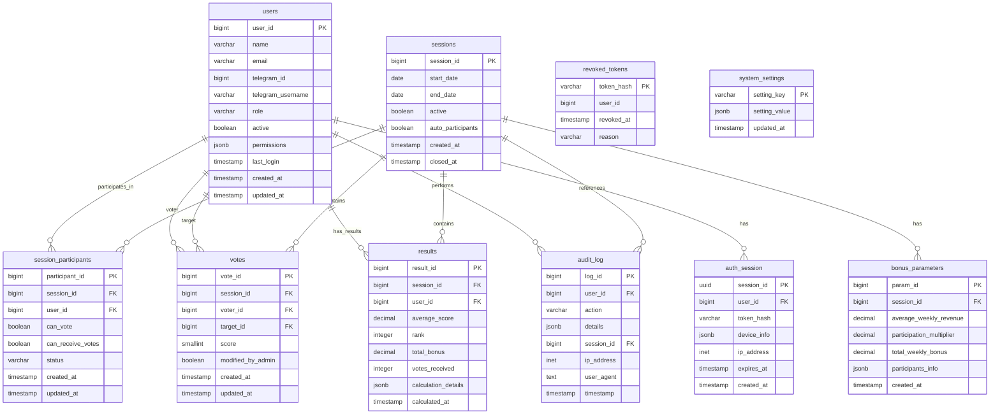

# База данных системы «Умная премия»

## Содержание
1. [Обзор системы](#1-обзор-системы)
2. [ER-диаграмма](#2-er-диаграмма)
3. [Описание таблиц](#3-описание-таблиц)
4. [Система ролей и разрешений](#4-система-ролей-и-разрешений)
5. [Индексы для оптимизации](#5-индексы-для-оптимизации)
6. [Триггеры](#6-триггеры)
7. [Миграции и начальные данные](#7-миграции-и-начальные-данные)
8. [Примеры SQL-запросов](#8-примеры-sql-запросов)
9. [Резервное копирование](#9-резервное-копирование)

---

## 1. Обзор системы

База данных системы «Умная премия» построена на PostgreSQL и обеспечивает:
- Управление пользователями и ролями
- Организацию сессий голосования
- Хранение голосов и результатов
- Аудит всех действий
- Гибкую систему разрешений

---

## 2. ER-диаграмма



---

## 3. Описание таблиц

### 3.1 Таблица `users` - Пользователи системы

```sql
CREATE TABLE users (
    user_id BIGINT PRIMARY KEY,
    name VARCHAR(255) NOT NULL,
    email VARCHAR(255),
    telegram_id BIGINT UNIQUE,
    telegram_username VARCHAR(255),
    role VARCHAR(20) DEFAULT 'user' CHECK (role IN ('user', 'manager', 'admin')),
    active BOOLEAN DEFAULT TRUE,
    permissions JSONB DEFAULT '[]',
    last_login TIMESTAMP,
    created_at TIMESTAMP DEFAULT CURRENT_TIMESTAMP,
    updated_at TIMESTAMP DEFAULT CURRENT_TIMESTAMP
);
```

**Полное описание полей:**

|         Поле        |      Тип     |        Ограничения        |                       Описание                      |
|---------------------|--------------|---------------------------|-----------------------------------------------------|
| `user_id`           | BIGINT       | PRIMARY KEY               | Уникальный идентификатор пользователя (Telegram ID) |
| `name`              | VARCHAR(255) | NOT NULL                  | ФИО сотрудника                                      |
| `email`             | VARCHAR(255) | NULL                      | Email адрес (опционально)                           |
| `telegram_id`       | BIGINT       | UNIQUE                    | ID пользователя в Telegram                          |
| `telegram_username` | VARCHAR(255) | NULL                      | Username в Telegram                                 |
| `role`              | VARCHAR(20)  | CHECK: user/manager/admin | Роль пользователя в системе                         |
| `active`            | BOOLEAN      | DEFAULT TRUE              | Флаг активности пользователя                        |
| `permissions`       | JSONB        | DEFAULT '[]'              | Массив разрешений пользователя в JSON               |
| `last_login`        | TIMESTAMP    | NULL                      | Время последнего входа в систему                    |
| `created_at`        | TIMESTAMP    | DEFAULT CURRENT_TIMESTAMP | Время создания записи                               |
| `updated_at`        | TIMESTAMP    | DEFAULT CURRENT_TIMESTAMP | Время последнего обновления                         |

---

### 3.2 Таблица `sessions` - Сессии голосования

```sql
CREATE TABLE sessions (
    session_id BIGSERIAL PRIMARY KEY,
    start_date DATE NOT NULL,
    end_date DATE NOT NULL,
    active BOOLEAN DEFAULT TRUE,
    auto_participants BOOLEAN DEFAULT TRUE,
    created_at TIMESTAMP DEFAULT CURRENT_TIMESTAMP,
    closed_at TIMESTAMP NULL
);
```

**Полное описание полей:**

|         Поле        |     Тип   |         Ограничения       |                Описание                   |
|---------------------|-----------|---------------------------|-------------------------------------------|
| `session_id`        | BIGSERIAL | PRIMARY KEY               | Автоинкрементный идентификатор сессии     |
| `start_date`        | DATE      | NOT NULL                  | Дата начала голосования                   |
| `end_date`          | DATE      | NOT NULL                  | Дата окончания голосования                |
| `active`            | BOOLEAN   | DEFAULT TRUE              | Флаг активности сессии                    |
| `auto_participants` | BOOLEAN   | DEFAULT TRUE              | Автоматическое добавление участников      |
| `created_at`        | TIMESTAMP | DEFAULT CURRENT_TIMESTAMP | Время создания сессии                     |
| `closed_at`         | TIMESTAMP | NULL                      | Время закрытия сессии (NULL если активна) |

---

### 3.3 Таблица `session_participants` - Участники сессий

```sql
CREATE TABLE session_participants (
    participant_id BIGSERIAL PRIMARY KEY,
    session_id BIGINT NOT NULL REFERENCES sessions(session_id) ON DELETE CASCADE,
    user_id BIGINT NOT NULL REFERENCES users(user_id) ON DELETE CASCADE,
    can_vote BOOLEAN DEFAULT TRUE,
    can_receive_votes BOOLEAN DEFAULT TRUE,
    status VARCHAR(20) DEFAULT 'active' CHECK (status IN ('active', 'excluded', 'vacation', 'sick_leave')),
    created_at TIMESTAMP DEFAULT CURRENT_TIMESTAMP,
    updated_at TIMESTAMP DEFAULT CURRENT_TIMESTAMP,
    UNIQUE(session_id, user_id)
);
```

**Полное описание полей:**

| Поле | Тип | Ограничения | Описание |
|------|-----|-------------|-----------|
| `participant_id` | BIGSERIAL | PRIMARY KEY | Автоинкрементный идентификатор |
| `session_id` | BIGINT | FOREIGN KEY, NOT NULL | Ссылка на сессию |
| `user_id` | BIGINT | FOREIGN KEY, NOT NULL | Ссылка на пользователя |
| `can_vote` | BOOLEAN | DEFAULT TRUE | Может ли пользователь голосовать |
| `can_receive_votes` | BOOLEAN | DEFAULT TRUE | Может ли пользователь получать голоса |
| `status` | VARCHAR(20) | CHECK: active/excluded/vacation/sick_leave | Статус участия |
| `created_at` | TIMESTAMP | DEFAULT CURRENT_TIMESTAMP | Время создания записи |
| `updated_at` | TIMESTAMP | DEFAULT CURRENT_TIMESTAMP | Время последнего обновления |

---

### 3.4 Таблица `bonus_parameters` - Параметры премии

```sql
CREATE TABLE bonus_parameters (
    param_id BIGSERIAL PRIMARY KEY,
    session_id BIGINT NOT NULL REFERENCES sessions(session_id) ON DELETE CASCADE,
    average_weekly_revenue DECIMAL(15,2),
    participation_multiplier DECIMAL(5,4) CHECK (participation_multiplier >= 0 AND participation_multiplier <= 1),
    total_weekly_bonus DECIMAL(15,2),
    participants_info JSONB,
    created_at TIMESTAMP DEFAULT CURRENT_TIMESTAMP
);
```

**Полное описание полей:**

|            Поле            |      Тип      |        Ограничения        |                  Описание                 |
|----------------------------|---------------|---------------------------|-------------------------------------------|
| `param_id`                 | BIGSERIAL     | PRIMARY KEY               | Автоинкрементный идентификатор параметров |
| `session_id`               | BIGINT        | FOREIGN KEY, NOT NULL     | Ссылка на сессию                          |
| `average_weekly_revenue`   | DECIMAL(15,2) | NULL                      | Средняя недельная выручка                 |
| `participation_multiplier` | DECIMAL(5,4)  | CHECK: 0-1                | Множитель участия                         |
| `total_weekly_bonus`       | DECIMAL(15,2) | NULL                      | Общая сумма премии                        |
| `participants_info`        | JSONB         | NULL                      | JSON с информацией о составе команды      |
| `created_at`               | TIMESTAMP     | DEFAULT CURRENT_TIMESTAMP | Время создания параметров                 |

---

### 3.5 Таблица `votes` - Голоса пользователей

```sql
CREATE TABLE votes (
    vote_id BIGSERIAL PRIMARY KEY,
    session_id BIGINT NOT NULL REFERENCES sessions(session_id) ON DELETE CASCADE,
    voter_id BIGINT NOT NULL REFERENCES users(user_id) ON DELETE CASCADE,
    target_id BIGINT NOT NULL REFERENCES users(user_id) ON DELETE CASCADE,
    score SMALLINT NOT NULL CHECK (score >= 0 AND score <= 10),
    modified_by_admin BOOLEAN DEFAULT FALSE,
    created_at TIMESTAMP DEFAULT CURRENT_TIMESTAMP,
    updated_at TIMESTAMP DEFAULT CURRENT_TIMESTAMP
);
```

**Полное описание полей:**

|          Поле       |    Тип    |       Ограничения         |               Описание                |
|---------------------|-----------|---------------------------|---------------------------------------|
| `vote_id`           | BIGSERIAL | PRIMARY KEY               | Автоинкрементный идентификатор голоса |
| `session_id`        | BIGINT    | FOREIGN KEY, NOT NULL     | Сессия голосования                    |
| `voter_id`          | BIGINT    | FOREIGN KEY, NOT NULL     | Кто голосует (ссылка на users)        |
| `target_id`         | BIGINT    | FOREIGN KEY, NOT NULL     | За кого голосуют (ссылка на users)    |
| `score`             | SMALLINT  | CHECK: 0-10               | Оценка (0-10)                         |
| `modified_by_admin` | BOOLEAN   | DEFAULT FALSE             | Флаг изменения администратором        |
| `created_at`        | TIMESTAMP | DEFAULT CURRENT_TIMESTAMP | Время создания голоса                 |
| `updated_at`        | TIMESTAMP | DEFAULT CURRENT_TIMESTAMP | Время последнего обновления           |

---

### 3.6 Таблица `results` - Результаты расчётов

```sql
CREATE TABLE results (
    result_id BIGSERIAL PRIMARY KEY,
    session_id BIGINT NOT NULL REFERENCES sessions(session_id) ON DELETE CASCADE,
    user_id BIGINT NOT NULL REFERENCES users(user_id) ON DELETE CASCADE,
    average_score DECIMAL(5,2) CHECK (average_score >= 0 AND average_score <= 10),
    rank INTEGER CHECK (rank > 0),
    total_bonus DECIMAL(15,2) CHECK (total_bonus >= 0),
    votes_received INTEGER CHECK (votes_received >= 0),
    calculation_details JSONB,
    calculated_at TIMESTAMP DEFAULT CURRENT_TIMESTAMP
);
```

**Полное описание полей:**

|          Поле         |      Тип      |       Ограничения         |                 Описание                  |
|-----------------------|---------------|---------------------------|-------------------------------------------|
| `result_id`           | BIGSERIAL     | PRIMARY KEY               | Автоинкрементный идентификатор результата |
| `session_id`          | BIGINT        | FOREIGN KEY, NOT NULL     | Ссылка на сессию голосования              |
| `user_id`             | BIGINT        | FOREIGN KEY, NOT NULL     | Ссылка на пользователя                    |
| `average_score`       | DECIMAL(5,2)  | CHECK: 0-10               | Средняя оценка пользователя               |
| `rank`                | INTEGER       | CHECK: >0                 | Место в рейтинге                          |
| `total_bonus`         | DECIMAL(15,2) | CHECK: >=0                | Итоговая премия                           |
| `votes_received`      | INTEGER       | CHECK: >=0                | Количество полученных голосов             |
| `calculation_details` | JSONB         | NULL                      | JSON с промежуточными расчётами (_T1–_T4) |
| `calculated_at`       | TIMESTAMP     | DEFAULT CURRENT_TIMESTAMP | Время расчёта результатов                 |

---

### 3.7 Таблица `auth_session` - Сессии авторизации

```sql
CREATE TABLE auth_session (
    session_id UUID PRIMARY KEY DEFAULT gen_random_uuid(),
    user_id BIGINT NOT NULL REFERENCES users(user_id) ON DELETE CASCADE,
    token_hash VARCHAR(255) NOT NULL,
    device_info JSONB,
    ip_address INET,
    expires_at TIMESTAMP NOT NULL,
    created_at TIMESTAMP DEFAULT CURRENT_TIMESTAMP
);
```

**Полное описание полей:**

| Поле          |     Тип      |       Ограничения         |        Описание          |
|---------------|--------------|---------------------------|--------------------------|
| `session_id`  | UUID         | PRIMARY KEY               | UUID сессии              |
| `user_id`     | BIGINT       | FOREIGN KEY, NOT NULL     | Ссылка на пользователя   |
| `token_hash`  | VARCHAR(255) | NOT NULL                  | Хеш JWT токена           |
| `device_info` | JSONB        | NULL                      | Информация об устройстве |
| `ip_address`  | INET         | NULL                      | IP адрес входа           |
| `expires_at`  | TIMESTAMP    | NOT NULL                  | Время истечения сессии   |
| `created_at`  | TIMESTAMP    | DEFAULT CURRENT_TIMESTAMP | Время создания сессии    |

---

### 3.8 Таблица `revoked_tokens` - Отозванные токены

```sql
CREATE TABLE revoked_tokens (
    token_hash VARCHAR(255) PRIMARY KEY,
    user_id BIGINT NOT NULL,
    revoked_at TIMESTAMP DEFAULT CURRENT_TIMESTAMP,
    reason VARCHAR(100) CHECK (reason IN ('logout', 'security', 'expired', 'suspicious'))
);
```

**Полное описание полей:**

|     Поле     |      Тип     |               Ограничения                 |        Описание        |
|--------------|--------------|-------------------------------------------|------------------------|
| `token_hash` | VARCHAR(255) | PRIMARY KEY                               | Хеш отозванного токена |
| `user_id`    | BIGINT       | NOT NULL                                  | ID пользователя        |
| `revoked_at` | TIMESTAMP    | DEFAULT CURRENT_TIMESTAMP                 | Время отзыва токена    |
| `reason`     | VARCHAR(100) | CHECK: logout/security/expired/suspicious | Причина отзыва         |

---

### 3.9 Таблица `audit_log` - Журнал аудита

```sql
CREATE TABLE audit_log (
    log_id BIGSERIAL PRIMARY KEY,
    user_id BIGINT REFERENCES users(user_id) ON DELETE SET NULL,
    action VARCHAR(100) NOT NULL,
    details JSONB,
    session_id BIGINT REFERENCES sessions(session_id) ON DELETE SET NULL,
    ip_address INET,
    user_agent TEXT,
    timestamp TIMESTAMP DEFAULT CURRENT_TIMESTAMP
);
```

**Полное описание полей:**

|     Поле     |      Тип     |        Ограничения        |                Описание                 |
|--------------|--------------|---------------------------|-----------------------------------------|
| `log_id`     | BIGSERIAL    | PRIMARY KEY               | Автоинкрементный идентификатор записи   |
| `user_id`    | BIGINT       | FOREIGN KEY, NULL         | Пользователь, совершивший действие      |
| `action`     | VARCHAR(100) | NOT NULL                  | Тип действия                            |
| `details`    | JSONB        | NULL                      | Дополнительные данные в JSON            |
| `session_id` | BIGINT       | FOREIGN KEY, NULL         | Связанная сессия                        |
| `ip_address` | INET         | NULL                      | IP адрес, с которого выполнено действие |
| `user_agent` | TEXT         | NULL                      | Информация о браузере/клиенте           |
| `timestamp`  | TIMESTAMP    | DEFAULT CURRENT_TIMESTAMP | Время действия                          |

---

### 3.10 Таблица `system_settings` - Настройки системы

```sql
CREATE TABLE system_settings (
    setting_key VARCHAR(100) PRIMARY KEY,
    setting_value JSONB NOT NULL,
    updated_at TIMESTAMP DEFAULT CURRENT_TIMESTAMP
);
```

**Полное описание полей:**

|       Поле      |      Тип     |        Ограничения        |          Описание           |
|-----------------|--------------|---------------------------|-----------------------------|
| `setting_key`   | VARCHAR(100) | PRIMARY KEY               | Ключ настройки              |
| `setting_value` | JSONB        | NOT NULL                  | Значение настройки в JSON   |
| `updated_at`    | TIMESTAMP    | DEFAULT CURRENT_TIMESTAMP | Время последнего обновления |

---

## 4. Система ролей и разрешений

### 4.1 Уровни доступа

|    Роль     |        Описание       |                             Доступ                           |
|-------------|-----------------------|--------------------------------------------------------------|
| **user**    | Обычный сотрудник     | Голосовать, смотреть свои результаты                         |
| **manager** | Менеджер/Руководитель | Просмотр результатов команды, ограниченное администрирование |
| **admin**   | Администратор системы | Полный доступ ко всем функциям                               |

### 4.2 Разрешения (permissions)

```sql
-- Предустановленные разрешения
INSERT INTO system_settings (setting_key, setting_value) VALUES
('available_permissions', '[
  "users:read",
  "users:write", 
  "sessions:read",
  "sessions:manage",
  "votes:read",
  "votes:manage",
  "results:read", 
  "exports:read",
  "settings:read",
  "settings:write",
  "logs:read",
  "*"
]'::jsonb);
```

### 4.3 Предустановленные роли

```sql
-- Настройки ролей по умолчанию
INSERT INTO system_settings (setting_key, setting_value) VALUES
('default_user_permissions', '[]'::jsonb),
('default_manager_permissions', '["users:read", "sessions:read", "results:read", "exports:read"]'::jsonb),
('default_admin_permissions', '["*"]'::jsonb);
```

---

## 5. Индексы для оптимизации

### 5.1 Основные индексы

```sql
-- Таблица users
CREATE INDEX idx_users_telegram_id ON users(telegram_id);
CREATE INDEX idx_users_email ON users(email);
CREATE INDEX idx_users_role ON users(role);
CREATE INDEX idx_users_active ON users(active);
CREATE INDEX idx_users_telegram_username ON users(telegram_username);
CREATE INDEX idx_users_last_login ON users(last_login);

-- Таблица sessions
CREATE INDEX idx_sessions_active ON sessions(active);
CREATE INDEX idx_sessions_dates ON sessions(start_date, end_date);
CREATE INDEX idx_sessions_created ON sessions(created_at);
CREATE INDEX idx_sessions_closed ON sessions(closed_at);

-- Таблица session_participants
CREATE INDEX idx_session_participants_session ON session_participants(session_id);
CREATE INDEX idx_session_participants_user ON session_participants(user_id);
CREATE INDEX idx_session_participants_status ON session_participants(status);
CREATE INDEX idx_session_participants_can_vote ON session_participants(can_vote);
CREATE INDEX idx_session_participants_can_receive ON session_participants(can_receive_votes);
CREATE INDEX idx_session_participants_session_user ON session_participants(session_id, user_id);

-- Таблица votes
CREATE UNIQUE INDEX idx_votes_unique ON votes(session_id, voter_id, target_id);
CREATE INDEX idx_votes_session_voter ON votes(session_id, voter_id);
CREATE INDEX idx_votes_session_target ON votes(session_id, target_id);
CREATE INDEX idx_votes_score ON votes(score);
CREATE INDEX idx_votes_modified ON votes(modified_by_admin);
CREATE INDEX idx_votes_created ON votes(created_at);

-- Таблица results
CREATE UNIQUE INDEX idx_results_unique ON results(session_id, user_id);
CREATE INDEX idx_results_session_rank ON results(session_id, rank);
CREATE INDEX idx_results_average_score ON results(average_score);
CREATE INDEX idx_results_total_bonus ON results(total_bonus);
CREATE INDEX idx_results_calculated ON results(calculated_at);

-- Таблица auth_session
CREATE INDEX idx_auth_session_user_id ON auth_session(user_id);
CREATE INDEX idx_auth_session_expires ON auth_session(expires_at);
CREATE INDEX idx_auth_session_token_hash ON auth_session(token_hash);
CREATE INDEX idx_auth_session_created ON auth_session(created_at);

-- Таблица revoked_tokens
CREATE INDEX idx_revoked_tokens_user_id ON revoked_tokens(user_id);
CREATE INDEX idx_revoked_tokens_revoked_at ON revoked_tokens(revoked_at);
CREATE INDEX idx_revoked_tokens_reason ON revoked_tokens(reason);

-- Таблица audit_log
CREATE INDEX idx_audit_log_user ON audit_log(user_id);
CREATE INDEX idx_audit_log_session ON audit_log(session_id);
CREATE INDEX idx_audit_log_timestamp ON audit_log(timestamp);
CREATE INDEX idx_audit_log_action ON audit_log(action);
CREATE INDEX idx_audit_log_ip ON audit_log(ip_address);

-- Таблица bonus_parameters
CREATE INDEX idx_bonus_parameters_session ON bonus_parameters(session_id);
CREATE INDEX idx_bonus_parameters_created ON bonus_parameters(created_at);
```

### 5.2 Составные индексы для сложных запросов

```sql
-- Для поиска активных участников с правом голосовать
CREATE INDEX idx_participants_active_voters ON session_participants(session_id, status, can_vote) 
WHERE status = 'active' AND can_vote = true;

-- Для статистики голосования
CREATE INDEX idx_votes_session_stats ON votes(session_id, voter_id, target_id, score);

-- Для быстрого подсчета голосов
CREATE INDEX idx_votes_counting ON votes(session_id, target_id, score);

-- Для поиска не проголосовавших участников
CREATE INDEX idx_participants_not_voted ON session_participants(session_id, can_vote, user_id) 
WHERE can_vote = true;

-- Для аудита по времени и действию
CREATE INDEX idx_audit_time_action ON audit_log(timestamp, action);
```

---

## 6. Триггеры

### 6.1 Автоматическое обновление updated_at

```sql
CREATE OR REPLACE FUNCTION update_updated_at_column()
RETURNS TRIGGER AS $$
BEGIN
    NEW.updated_at = CURRENT_TIMESTAMP;
    RETURN NEW;
END;
$$ language 'plpgsql';

-- Триггеры для таблиц с updated_at
CREATE TRIGGER update_users_updated_at BEFORE UPDATE ON users FOR EACH ROW EXECUTE FUNCTION update_updated_at_column();
CREATE TRIGGER update_votes_updated_at BEFORE UPDATE ON votes FOR EACH ROW EXECUTE FUNCTION update_updated_at_column();
CREATE TRIGGER update_session_participants_updated_at BEFORE UPDATE ON session_participants FOR EACH ROW EXECUTE FUNCTION update_updated_at_column();
```

### 6.2 Логирование изменений ролей

```sql
CREATE OR REPLACE FUNCTION log_role_changes()
RETURNS TRIGGER AS $$
BEGIN
    IF OLD.role != NEW.role OR OLD.permissions != NEW.permissions THEN
        INSERT INTO audit_log (user_id, action, details)
        VALUES (
            current_setting('app.current_user_id', true)::bigint,
            'role_change',
            json_build_object(
                'target_user_id', NEW.user_id,
                'target_user_name', NEW.name,
                'old_role', OLD.role,
                'new_role', NEW.role,
                'old_permissions', OLD.permissions,
                'new_permissions', NEW.permissions
            )
        );
    END IF;
    RETURN NEW;
END;
$$ language 'plpgsql';

CREATE TRIGGER log_user_role_changes AFTER UPDATE ON users FOR EACH ROW EXECUTE FUNCTION log_role_changes();
```

### 6.3 Логирование изменений голосов

```sql
CREATE OR REPLACE FUNCTION log_vote_changes()
RETURNS TRIGGER AS $$
BEGIN
    IF OLD.score != NEW.score AND NEW.modified_by_admin = TRUE THEN
        INSERT INTO audit_log (user_id, action, details, session_id)
        VALUES (
            current_setting('app.current_user_id', true)::bigint,
            'vote_modified',
            json_build_object(
                'vote_id', NEW.vote_id,
                'voter_id', NEW.voter_id,
                'target_id', NEW.target_id,
                'old_score', OLD.score,
                'new_score', NEW.score,
                'modified_by_admin', true
            ),
            NEW.session_id
        );
    END IF;
    RETURN NEW;
END;
$$ language 'plpgsql';

CREATE TRIGGER log_vote_updates AFTER UPDATE ON votes FOR EACH ROW EXECUTE FUNCTION log_vote_changes();
```

### 6.4 Логирование изменений участников

```sql
CREATE OR REPLACE FUNCTION log_participant_changes()
RETURNS TRIGGER AS $$
BEGIN
    IF OLD.can_vote != NEW.can_vote OR OLD.can_receive_votes != NEW.can_receive_votes OR OLD.status != NEW.status THEN
        INSERT INTO audit_log (user_id, action, details, session_id)
        VALUES (
            current_setting('app.current_user_id', true)::bigint,
            'participant_updated',
            json_build_object(
                'participant_id', NEW.participant_id,
                'user_id', NEW.user_id,
                'old_can_vote', OLD.can_vote,
                'new_can_vote', NEW.can_vote,
                'old_can_receive', OLD.can_receive_votes,
                'new_can_receive', NEW.can_receive_votes,
                'old_status', OLD.status,
                'new_status', NEW.status
            ),
            NEW.session_id
        );
    END IF;
    RETURN NEW;
END;
$$ language 'plpgsql';

CREATE TRIGGER log_participant_updates AFTER UPDATE ON session_participants FOR EACH ROW EXECUTE FUNCTION log_participant_changes();
```

### 6.5 Автоматическое добавление участников при создании сессии

```sql
CREATE OR REPLACE FUNCTION auto_add_participants()
RETURNS TRIGGER AS $$
BEGIN
    IF NEW.auto_participants = TRUE THEN
        INSERT INTO session_participants (session_id, user_id, can_vote, can_receive_votes, status)
        SELECT 
            NEW.session_id,
            u.user_id,
            CASE 
                WHEN u.role = 'admin' THEN false  -- админы по умолчанию не голосуют
                ELSE true 
            END as can_vote,
            true as can_receive_votes,
            'active' as status
        FROM users u
        WHERE u.active = true
        ON CONFLICT (session_id, user_id) DO NOTHING;
        
        -- Логируем автоматическое добавление
        INSERT INTO audit_log (action, details, session_id)
        VALUES (
            'participants_auto_added',
            json_build_object(
                'session_id', NEW.session_id,
                'added_count', (SELECT COUNT(*) FROM users WHERE active = true)
            ),
            NEW.session_id
        );
    END IF;
    RETURN NEW;
END;
$$ language 'plpgsql';

CREATE TRIGGER auto_add_participants_trigger AFTER INSERT ON sessions FOR EACH ROW EXECUTE FUNCTION auto_add_participants();
```

---

## 7. Миграции и начальные данные

### 7.1 Начальная миграция

```sql
-- Создание первого администратора системы
INSERT INTO users (user_id, name, role, permissions, active) 
VALUES (
    1, 
    'Главный администратор', 
    'admin', 
    '["*"]'::jsonb, 
    true
);

-- Настройки системы по умолчанию
INSERT INTO system_settings (setting_key, setting_value) VALUES
('vote_scale_min', '0'),
('vote_scale_max', '10'),
('self_vote_weight', '0.8'),
('min_votes_required', '3'),
('session_duration_days', '7'),
('auto_create_sessions', 'true'),
('auto_add_participants', 'true'),
('session_start_day', 'monday'),
('advance_creation_days', '1'),
('reopen_window_hours', '72'),
('backup_enabled', 'true'),
('backup_schedule', '0 2 * * *'),
('backup_retention_days', '30'),
('notifications_enabled', 'true');
```

### 7.2 Функция для расчета результатов

```sql
CREATE OR REPLACE FUNCTION calculate_session_results(session_id BIGINT)
RETURNS TABLE(
    user_id BIGINT,
    average_score DECIMAL(5,2),
    votes_received INTEGER,
    rank INTEGER,
    total_bonus DECIMAL(15,2),
    calculation_details JSONB
) AS $$
DECLARE
    total_bonus DECIMAL(15,2);
    total_points DECIMAL(15,2);
    bonus_params RECORD;
BEGIN
    -- Получаем параметры премии
    SELECT total_weekly_bonus INTO bonus_params
    FROM bonus_parameters 
    WHERE session_id = $1 
    ORDER BY created_at DESC 
    LIMIT 1;
    
    -- Рассчитываем средние оценки и количество голосов
    RETURN QUERY
    WITH user_scores AS (
        SELECT 
            v.target_id as user_id,
            AVG(v.score) as average_score,
            COUNT(*) as votes_received,
            json_build_object(
                'T1_raw_scores', array_agg(v.score),
                'T2_average', AVG(v.score),
                'T3_normalized', (AVG(v.score) / 10.0) * 100,
                'T4_final', AVG(v.score)  -- здесь может быть сложная логика нормализации
            ) as calculation_details
        FROM votes v
        WHERE v.session_id = $1
        GROUP BY v.target_id
    ),
    ranked_scores AS (
        SELECT 
            us.*,
            RANK() OVER (ORDER BY us.average_score DESC) as rank_position
        FROM user_scores us
    )
    SELECT 
        rs.user_id,
        rs.average_score,
        rs.votes_received,
        rs.rank_position::INTEGER,
        CASE 
            WHEN bonus_params.total_weekly_bonus IS NOT NULL THEN
                (rs.average_score / NULLIF(SUM(rs.average_score) OVER(), 0)) * bonus_params.total_weekly_bonus
            ELSE 0
        END as total_bonus,
        rs.calculation_details
    FROM ranked_scores rs;
    
END;
$$ LANGUAGE plpgsql;
```

---

## 8. Примеры SQL-запросов

### 8.1 Авторизация и сессии

```sql
-- Поиск пользователя по Telegram ID для авторизации
SELECT user_id, name, role, permissions, active 
FROM users 
WHERE telegram_id = 123456789 AND active = TRUE;

-- Создание сессии авторизации
INSERT INTO auth_session (user_id, token_hash, device_info, ip_address, expires_at)
VALUES (123456789, 'hash123', '{"browser": "Chrome"}', '192.168.1.100', NOW() + INTERVAL '1 hour');

-- Проверка JWT токена
SELECT us.user_id, us.name, us.role, us.permissions, us.active
FROM auth_session auth
JOIN users us ON auth.user_id = us.user_id
WHERE auth.token_hash = 'hash123' 
  AND auth.expires_at > NOW()
  AND us.active = TRUE;
```

### 8.2 Управление участниками

```sql
-- Получение участников с правом голосовать для сессии
SELECT 
    u.user_id,
    u.name,
    u.telegram_username,
    sp.can_vote,
    sp.status,
    EXISTS(
        SELECT 1 FROM votes v 
        WHERE v.session_id = 18 
        AND v.voter_id = 123456789 
        AND v.target_id = u.user_id
    ) as has_voted
FROM session_participants sp
JOIN users u ON sp.user_id = u.user_id
WHERE sp.session_id = 18 
  AND sp.can_receive_votes = true
  AND sp.status = 'active'
  AND u.active = true
  AND u.user_id != 123456789  -- исключаем себя
ORDER BY u.name;

-- Статистика участия по сессии
SELECT 
    COUNT(*) as total_participants,
    COUNT(CASE WHEN sp.can_vote = true THEN 1 END) as can_vote_count,
    COUNT(CASE WHEN sp.can_receive_votes = true THEN 1 END) as can_receive_count,
    COUNT(CASE WHEN sp.status = 'active' THEN 1 END) as active_count,
    COUNT(CASE WHEN v.voter_id IS NOT NULL THEN 1 END) as voted_count,
    ROUND(COUNT(CASE WHEN v.voter_id IS NOT NULL THEN 1 END) * 100.0 / COUNT(*), 2) as participation_rate
FROM session_participants sp
LEFT JOIN (
    SELECT DISTINCT voter_id 
    FROM votes 
    WHERE session_id = 18
) v ON sp.user_id = v.voter_id
WHERE sp.session_id = 18;
```

### 8.3 Голосование и результаты

```sql
-- Сохранение голосов с проверкой прав
INSERT INTO votes (session_id, voter_id, target_id, score) 
SELECT 
    18 as session_id,
    123456789 as voter_id,
    target_id,
    score
FROM (VALUES 
    (101, 8),
    (102, 9),
    (103, 7)
) as votes_data(target_id, score)
WHERE EXISTS (
    SELECT 1 FROM session_participants sp
    WHERE sp.session_id = 18 
      AND sp.user_id = 123456789 
      AND sp.can_vote = true
      AND sp.status = 'active'
)
AND EXISTS (
    SELECT 1 FROM session_participants sp
    WHERE sp.session_id = 18 
      AND sp.user_id = votes_data.target_id
      AND sp.can_receive_votes = true
      AND sp.status = 'active'
)
ON CONFLICT (session_id, voter_id, target_id) 
DO UPDATE SET 
    score = EXCLUDED.score,
    updated_at = CURRENT_TIMESTAMP;

-- Расчет результатов сессии
SELECT * FROM calculate_session_results(18);
```

### 8.4 Аналитика и отчетность

```sql
-- Сравнительная аналитика по сессиям
SELECT 
    s.session_id,
    s.start_date,
    s.end_date,
    COUNT(DISTINCT sp.user_id) as total_participants,
    COUNT(DISTINCT v.voter_id) as voted_particip